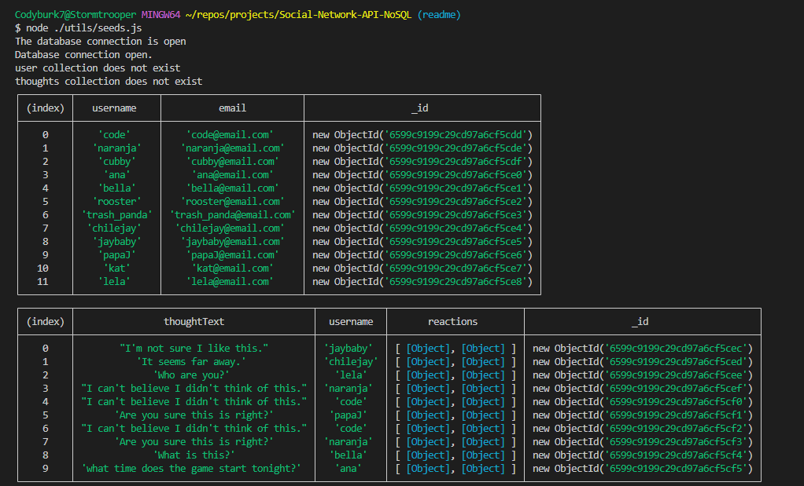

# Friendify (Social Network API - NoSQL)
This application uses NoSQL and MongoDB to build a social networking API.

## Description

The Friendify social networking application allows end users to share their thoughts, react to another person's thoughts, and also maintain a list of friends from the application's registered users.  This is achieved through a database connection that leverages the `mongoose` package.  Routes have been defined for thoughts, users, and reactions.  All routes query the database and return the requested information.  A general `GET` request can be made to the root of each route or more specific `GET` queries can be performed through the use of the document's _id.  `POST`, `PUT`, and `DELETE` functionality has also been defined within the respective routes to provide to the full suite of CRUD operations.

## Table of Contents 

- [Installation](#installation)  
- [Usage](#usage)  
- [License](#license)
- [Questions](#questions)  
      
    
## Installation

The Friendify application can be installed by cloning the repository to your local machine.  Please note, `Node.js` is required in order to run this application and will need to be installed before attempting to run the program.  The package dependencies are included within the package.json file and can be installed through a simple `npm i` command once the repository has been successfully cloned on the local computer.  The `mongoose` and `express` modules are required for this application to run correctly and must be installed prior to starting the server.

## Usage

Data can be seeded by using the `node ./utils/seeds.js` command in the terminal.  If called correctly through the command line interface (CLI), tables of the seeded data similar to what is pictured below should be presented in the terminal.  The data will not be an exact match as it will be unique every time.  The seeds.js file uses random functions to generate the thought data and reactions from a pre-defined array within the data.js file.  New values could be added to the data used to create seeds through the random functions to provide more options if required for future iterations of the application.

The application is initialized by running the `node server.js` command through the terminal.  When the `server.js` file is called, it syncs the MongoDB database through mongoose and starts the express application, listening on port 7075.  Requests can be sent to the application using the routes defined within the `routes/api` directory using the following syntax: `localhost:7075/api/<route name>`.  The routes that can be queried are: `api/thoughts` and `api/users`.  Requests can be sent through an application such as Insomnia or Postman to retrieve related data from the database.  Each endpoint has a `GET`, `POST`, `PUT`, and `DELETE` endpoint defined.  The `GET` endpoint will use a find method to retrieve all documents from the given collection if no id is specified.  If an id is given as an additional parameter through the GET request, the individual document pertaining to that id will be retrieved.

Bonus: The ability to add thoughts to a user's array and remove the thought when deleted is included in the application.  The /api/users/:userId/thoughts/thoughtId route allows for thoughts to be associated with a specific user.  The $pull operator is used in the thought delete route to query the database and find the user's document containing the specific _id of the thought being deleted.

A link to the video demonstrating the application's use can be found here: [Walk-through Video](https://drive.google.com/file/d/1cLFRmF_TB6ei2AEgiNFzbxYYty4w9wO2/view)

## License

This application is covered under the license linked below.  For further information regarding the license and its terms, please consult the official licensing documentation using the provided link.

[License: MIT](https://opensource.org/licenses/MIT)

## Contributions

No additional contributions were received from other sources for the completion of this project.

## Questions
  
GitHub: [chilejay7](https://github.com/chilejay7?tab=repositories)  
Email: codyburk7@gmail.com

